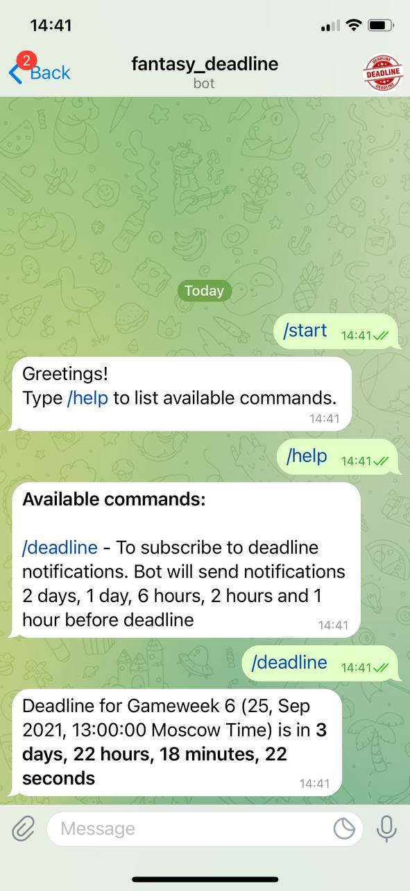

# PL Fantasy Deadline Bot

## [@fantasy_deadline_bot](https://t.me/fantasy_deadline_bot)

This bot will notify you about the time left before deadline to make transfers in your team in [Fantasy Premier League](https://fantasy.premierleague.com/) before each Gameweek, so you won't miss a chance to make your team stronger and stay ahead of competition. Once you subscribe to the updates, bot will send you notifications 48, 24, 6, 2, 1 hours before deadline. 

All data is supplied by [Fantasy Premier League API](https://fantasy.premierleague.com/api/bootstrap-static/).

Server is hosted on [Heroku](https://heroku.com/). 
Data is stored on Dropbox ([Dropbox API](https://www.dropbox.com/developers/)).

## Demo

 

## How to create a bot
 - [Telegram Documentation](https://core.telegram.org/bots#3-how-do-i-create-a-bot)

## Built with
 - [pyTelegramBotAPI](https://github.com/eternnoir/pyTelegramBotAPI)
